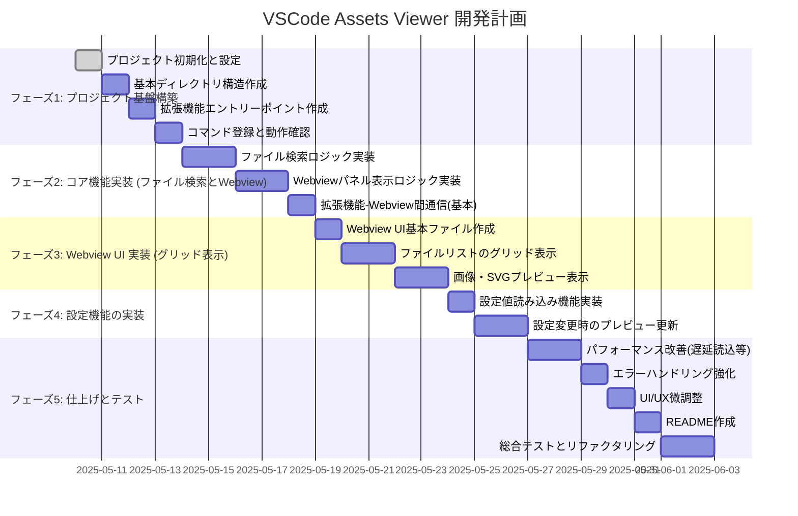
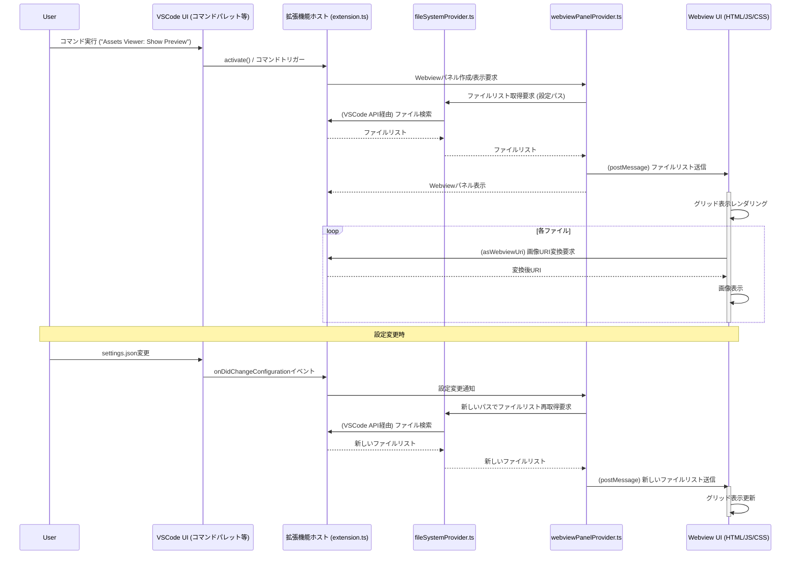

## VSCode Assets Viewer 拡張機能 開発計画

### 1. プロジェクトの目的と範囲（再確認）

- **目的:** 指定ディレクトリ配下の画像・SVG ファイルをグリッド形式で一覧プレビューする VSCode 拡張機能の開発。
- **主要機能:**
  1.  画像・SVG ファイルのプレビュー表示。
  2.  表示パスのカスタマイズ (`settings.json`)。
- **技術スタック:** TypeScript, VSCode Extension API, Webview API, pnpm。

詳細は各メモリバンクファイルをご参照ください。

### 2. 開発フェーズと主要タスク



### 3. 推奨ディレクトリ構造

```
.
├── .cline/memory/              # メモリバンクファイル
├── .git/                       # Gitリポジトリ (初期化後)
├── .vscode/
│   ├── launch.json             # デバッグ設定
│   └── settings.json           # ワークスペース設定 (推奨)
├── node_modules/               # pnpmが管理 (実際は .pnpmストアへのリンク)
├── out/                        # コンパイル後のJSファイル出力先
├── src/                        # 拡張機能本体のTypeScriptソースコード
│   ├── extension.ts            # 拡張機能のエントリーポイント (activate, deactivate)
│   ├── fileSystemProvider.ts   # ファイル検索ロジック
│   ├── webviewPanelProvider.ts # Webviewパネルの作成・管理
│   └── types.ts                # プロジェクト固有の型定義 (任意)
├── webview-ui/                 # Webview UI関連ファイル
│   ├── index.html              # WebviewのHTML構造
│   ├── main.js                 # WebviewのクライアントサイドJavaScript
│   ├── styles.css              # WebviewのCSS
│   └── assets/                 # Webview UIで使用するローカルアセット (あれば)
├── .eslintignore
├── .eslintrc.json
├── .gitignore
├── .prettierignore
├── .prettierrc.json
├── CHANGELOG.md                # 変更履歴 (推奨)
├── package.json                # プロジェクト定義、依存関係、スクリプト
├── pnpm-lock.yaml              # pnpmロックファイル
├── README.md                   # プロジェクトの説明、使用方法
└── tsconfig.json               # TypeScriptコンパイラ設定
```

### 4. 主要コンポーネントと連携



### 5. 開発ステップ詳細 (フェーズ 1 の例)

**フェーズ 1: プロジェクト基盤構築**

1.  **プロジェクト初期化と設定:**
    - コマンド:
      ```bash
      mkdir vscode-assets-viewer
      cd vscode-assets-viewer
      pnpm init
      pnpm add -D typescript @types/vscode @types/node esbuild vscode-test eslint prettier @typescript-eslint/parser @typescript-eslint/eslint-plugin eslint-config-prettier eslint-plugin-prettier
      # (必要に応じてyo codeで雛形生成し、pnpm用に調整)
      ```
    - `package.json` の主要フィールド設定 (`name`, `displayName`, `description`, `version`, `publisher`, `engines.vscode`, `activationEvents`, `main`, `contributes.commands`, `contributes.configuration` など)。
    - `pnpm` スクリプト設定 (`compile`, `watch`, `lint`, `format`, `test` など)。
2.  **基本ディレクトリ構造作成:** 上記「3. 推奨ディレクトリ構造」に従い、`src`, `webview-ui` などのディレクトリを作成。
3.  **拡張機能エントリーポイント作成:**
    - `src/extension.ts` に `activate` と `deactivate` 関数を作成。
    - `activate` 内でコマンド登録の準備。
4.  **コマンド登録と動作確認:**
    - `package.json` の `contributes.commands` にコマンドを定義。
    - `extension.ts` の `activate` で `vscode.commands.registerCommand` を使用してコマンドを登録。
    - 登録したコマンドを実行すると、コンソールにログが出力されることを確認 (F5 デバッグ)。
    - `tsconfig.json` (module: commonjs, target: es2020, outDir: out, rootDir: src, strict: true など) と `launch.json` (デバッグ実行用) を設定。
    - ESLint ([`.eslintrc.json`](eslintrc.json)) と Prettier ([`.prettierrc.json`](.prettierrc.json)) の設定ファイルを作成し、基本的なルールを定義。
