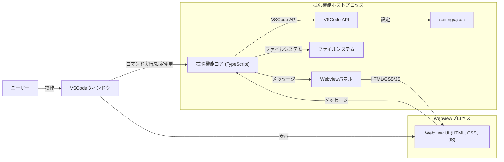

# システムパターン: VSCode Assets Viewer 拡張機能

## 1. システムアーキテクチャ概要

この VSCode 拡張機能は、主に以下の 2 つの主要コンポーネントから構成されます。

1.  **拡張機能本体 (Extension Host 側):**

    - VSCode の Extension Host プロセス内で実行される TypeScript コード。
    - VSCode API と直接対話し、拡張機能のコアロジックを担当します。
    - 主な責務:
      - コマンドの登録と実行（例: "Assets Viewer: Show Preview"）。
      - 設定 (`settings.json`) の読み込みと監視（表示パスなど）。
      - 指定されたディレクトリ内のファイルシステムのスキャン（画像・SVG ファイルの検索）。
      - Webview パネルの作成、表示、およびライフサイクル管理。
      - Webview との双方向メッセージング（ファイルリストの送信、Webview からのイベント受信など）。

2.  **Webview UI (Webview 側):**
    - VSCode 内で独立した Web コンテンツとして表示される UI 部分。
    - 標準的なウェブ技術（HTML, CSS, JavaScript）で構築されます。
    - 主な責務:
      - 拡張機能本体から受信したファイルリスト（ファイルパス、ファイル名など）に基づいて、アセットのグリッド表示をレンダリングする。
      - 画像の遅延読み込みやサムネイル生成（クライアントサイドで可能な範囲）。
      - ユーザーインタラクションの処理（例: スクロール、将来的な機能としてアイテムクリックなど）。
      - 必要に応じて拡張機能本体へメッセージを送信する。

## 2. 重要な技術的決定

- **VSCode Webview API の利用:**
  - リッチな UI を HTML, CSS, JavaScript で構築するために Webview を採用します。これにより、柔軟なレイアウトとインタラクションが可能になります。
  - Webview のセキュリティポリシー（`Content-Security-Policy`）に準拠し、安全なコンテンツ表示を保証します。
- **VSCode API の活用:**
  - `vscode.commands.registerCommand` でコマンドを登録。
  - `vscode.window.createWebviewPanel` で Webview を作成・管理。
  - `vscode.workspace.getConfiguration` で `settings.json` から設定値を取得。
  - `vscode.workspace.findFiles` や Node.js の `fs` モジュール（拡張機能ホスト側で利用可能）を使用してファイルを検索。
  - Webview と拡張機能本体間の通信には `Webview.postMessage()` と `Webview.onDidReceiveMessage()` を使用。
- **TypeScript の採用:**
  - 静的型付けによる開発効率とコード品質の向上。
  - VSCode 拡張機能開発の標準的な言語。
- **pnpm によるパッケージ管理:**
  - 効率的なディスクスペース利用と高速なインストール。
- **非同期処理の徹底:**
  - ファイル I/O や時間のかかる処理は非同期（Async/Await）で行い、UI のブロッキングを防ぎます。

## 3. 設計パターンと考慮事項

- **Model-View-Controller (MVC) / Model-View-Presenter (MVP) に類似した分離:**
  - **Model:** ファイルデータ、設定値など。
  - **View:** Webview UI (HTML レンダリング)。
  - **Controller/Presenter:** 拡張機能本体のロジックが、データの取得、加工、Webview への指示を行う。
- **メッセージパッシング:**
  - 拡張機能本体と Webview UI 間の通信は、明確に定義されたメッセージプロトコルに基づいて行います。これにより、コンポーネント間の結合度を低く保ちます。
- **状態管理:**
  - Webview 側で表示するアセットリストや UI の状態は、JavaScript のオブジェクトやシンプルな状態管理ライブラリ（必要に応じて）で管理します。
- **エラーハンドリング:**
  - ファイルが見つからない場合、ディレクトリへのアクセス権がない場合、不正な設定値などのエラーケースを考慮し、ユーザーに分かりやすいフィードバックを提供します。
- **パフォーマンス:**
  - 多数の画像を扱う可能性があるため、画像の遅延読み込み（Intersection Observer API など）を Webview 側で実装することを検討します。
  - ファイル検索処理が長時間に及ぶ場合は、プログレス表示などを検討します。
- **セキュリティ:**
  - Webview に渡すデータは適切にサニタイズし、`file://` プロトコル経由でのローカルファイルアクセスは VSCode の `asWebviewUri` を使用して安全な URI に変換します。

## 4. コンポーネントの関係

上記のアーキテクチャ図と説明の通り、拡張機能本体が VSCode 環境と連携し、Webview UI が表示とユーザーインタラクションを担当します。両者は明確に分離され、メッセージングを通じて連携します。
